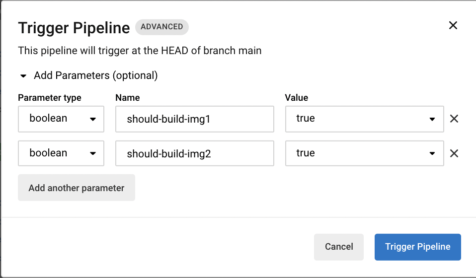

# explore-conditional-e2e

Fun times!

## Background

This sample project explores a workflow with the following acceptance criteria:

1. We have 2 jobs, eaching building a Docker image (short of publishing it to a image repository like Docker Hub)
2. Each of the 2 image-building job should build **only on specified pipeline parameter**
3. A downstream job for integration test should run **only if BOTH images are built** 

See the _.circleci/config.yml_ for the solution!

## Explanation of solution

We essentially make use of a "gatekeeper" job that short-circuits the workflow before the integration test runs, **if all the images are not built**.

The `circleci` tool offers a `step halt` to end a job](https://circleci.com/docs/2.0/configuration-reference/#ending-a-job-from-within-a-step).

However, this is to end a job, but not a workflow.
Hence, the solution here calls [the V2 API for cancelling a workflow](https://circleci.com/docs/api/v2/#operation/cancelWorkflow) instead.

**Note** that you would need to supply the `CIRCLE_TOKEN` as a project env var, in this case.

## Seeing is believing

By default, the 2 pipeline parameters are set to `false`.

Hence, in this workflow (triggered by push commit), we can see that the 2 image-building jobs "no-op".
This meant that the gatekeeping "determine-integration-should-run" job will cancel the workflow, before integration tests run.

https://app.circleci.com/pipelines/github/kelvintaywl/explore-conditional-e2e/2/workflows/7d328360-f428-4c06-8999-f96ffc489478

By manually triggering the pipeline and setting `true` for all the pipeline parameters,

We see that the new triggered workflow will build the 2 images, and allow for integration tests to run instead!

https://app.circleci.com/pipelines/github/kelvintaywl/explore-conditional-e2e/3/workflows/a18c93e9-5111-40d0-89ec-4a25b53651b8

If we choose to only set `should-build-img1` as true, then the workflow builds only img1 Docker image, and does not run the integration tests (expectedly) 🤓

https://app.circleci.com/pipelines/github/kelvintaywl/explore-conditional-e2e/5/workflows/6ed842ea-19df-4f7b-9855-f8457cfd067b
